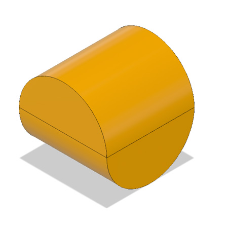

# Sphericons
This project contains the Fusion 360 models and STL files for a
range of 3D printable sphericons.  They are featured in my [Sphericons Rolls in a Wibbly Wobbly Way](https://www.youtube.com/watch?v=SpkDs6oRw_I) video posted to my YouTube channel for makers,
[Make It Down To Earth](https://www.youtube.com/channel/UCGBt41ue4j5QFqwPg0efcfQ).

Inspiration was drawn from Angus Deveson's [Incredibly Satisfying Sphericons](https://www.youtube.com/watch?v=wb29-ULRBaE)
on [Maker's Muse](https://www.youtube.com/channel/UCxQbYGpbdrh-b2ND-AfIybg)
and Devin Montes' [My Super Sphericon Collection with Astrolabicon Puzzle](https://www.youtube.com/watch?v=eESLIrxw2x0&t=666s)
video on [Make Anything](https://www.youtube.com/channel/UCVc6AHfGw9b2zOE_ZGfmsnw).

## Basic Sphericon Models

### Sphericon

### Dual Sphericon

### Hexasphericon

### Dual Hexasphericon

## Custom Designs

### "Atom Bomb" Elliptic Star Hexasphericon
Based on a profile created from three ellipses, similar to the simplified "electrons whizzing around a nucleus" diagram.

### "Orange Whip" Elliptic Star Decasphericon
Two identical parts joined with a centre peg and magnets.  Separate moulded base fits the contours of the decasphericon.

### Two Colour Decasphericon
Printed in separate parts so suitable for single colour 3D printers.

### Nested Hexasphericons
One hexasphericon inside another, rotated through 90 degrees.

### Yin Yang Double Revolve
This is simultaneously both a sphericon and its dual.  It was created using two separate revolves around different axes resulting in an interlocking Yin Yang form.

### Strange Loops
This isn't a sphericon but was created using the same basic technique to create a series of interlocking loops.

### Square Knot
Created by sweeping and twisting a hexagon around the outer path of a dual sphericon.  There are three such paths, each perpendicular to each other.  One large one around the outside and two smaller ones nested inside.

## Multi Colour Sphericons

These are all designed in parts to be printed on a single colour 3D printer.

### Chess Piece

### Cherry Apple

### Garter Snake

